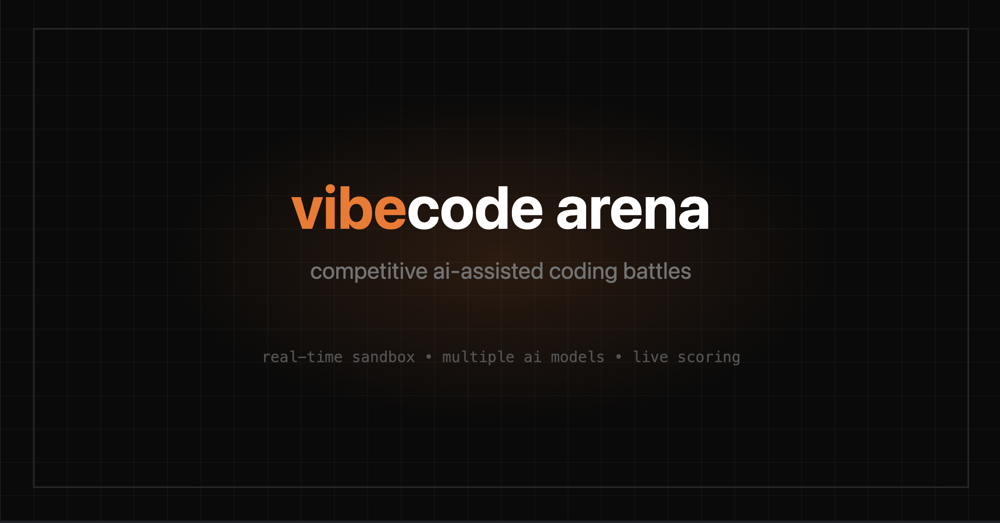

# vibecode arena

[](https://vibecodearena.dev)

Competitive multiplayer coding game where players pick an AI model and race to build UI components. Prompt your AI, watch your code render live, and outscore your friends. Kudos to the Claude Opus 4.5 for making me able to ship this over the weekend!


## How it works

1. **Create a room** — Get a 6-character code to share with friends
2. **Pick your AI** — Choose from Claude, GPT, Gemini, Llama, and more (each with different score multipliers - tougher models yield higher points)
3. **Compete in rounds** — See a reference UI component and prompt your AI to recreate it
4. **Watch it render** — Your code runs live in a sandboxed environment
5. **Get scored** — Points for accuracy, speed, and prompt efficiency

## Tech Stack

| Layer      | Technology                                                                                   |
| ---------- | -------------------------------------------------------------------------------------------- |
| Frontend   | [SvelteKit](https://kit.svelte.dev) + [Svelte 5](https://svelte.dev)                         |
| Styling    | [Tailwind CSS v4](https://tailwindcss.com)                                                   |
| Real-time  | [Cloudflare Durable Objects](https://developers.cloudflare.com/durable-objects/) + WebSocket |
| AI         | [Vercel AI SDK](https://sdk.vercel.ai) with [OpenRouter](https://openrouter.ai)              |
| Sandboxes  | [E2B](https://e2b.dev) for isolated code execution                                           |
| Validation | [Valibot](https://valibot.dev)                                                               |

## Project Structure

```
frontend/
├── src/
│   ├── routes/              # SvelteKit pages
│   │   ├── +page.svelte     # Home / create room
│   │   ├── join/            # Join room flow
│   │   └── [code]/          # Game room
│   ├── lib/
│   │   ├── components/      # Svelte components
│   │   │   ├── game/        # Game UI (Lobby, GameHeader, etc.)
│   │   │   └── ui/          # Shared UI components
│   │   ├── hooks/           # Svelte 5 runes (useGame, useChat)
│   │   ├── config/          # Game settings, models, challenges
│   │   ├── server/          # Server-side logic
│   │   │   ├── ai/          # AI prompts and chat
│   │   │   ├── do-client.ts # Durable Object client
│   │   │   └── e2b.ts       # Sandbox management
│   │   └── types/           # TypeScript types
│   └── app.html
├── worker/
│   └── src/
│       ├── index.ts         # Worker entry point
│       └── GameRoom.ts      # Durable Object (game state)
├── wrangler.toml            # Cloudflare config
└── package.json
```

## Development

### Prerequisites

- Node.js 20+
- [Wrangler CLI](https://developers.cloudflare.com/workers/wrangler/)
- [E2B API key](https://e2b.dev)
- [OpenRouter API key](https://openrouter.ai)

### Setup

```bash
# Install dependencies
npm install

# Set up environment variables
cp .env.example .env
# Edit .env with your API keys

# Run both frontend and worker
npm run dev:all
```

This starts:

- SvelteKit dev server on `http://localhost:5173`
- Wrangler dev server on `http://localhost:8788`

### Scripts

| Command              | Description                |
| -------------------- | -------------------------- |
| `npm run dev`        | Start SvelteKit dev server |
| `npm run dev:worker` | Start Wrangler dev server  |
| `npm run dev:all`    | Start both in parallel     |
| `npm run build`      | Build for production       |
| `npm run check`      | TypeScript + Svelte checks |
| `npm run lint`       | ESLint                     |
| `npm run format`     | Prettier                   |

## Environment Variables

```bash
# Required
OPENROUTER_API_KEY=sk-or-...
E2B_API_KEY=e2b_...

# Optional
PUBLIC_DO_URL=http://localhost:8788  # Durable Object URL (default for dev)
```

## Deployment

Everything runs on Cloudflare:

```bash
# Deploy the Durable Object worker (api.vibecodearena.dev)
bun run deploy:worker

# Deploy the SvelteKit app (vibecodearena.dev)
bun run deploy:app
```

**Environment Secrets (set via Wrangler):**

```bash
# For the Pages app
wrangler pages secret put E2B_API_KEY --project-name vibecode-arena
wrangler pages secret put OPENROUTER_API_KEY --project-name vibecode-arena
```

## Architecture

```
                              WebSocket (game events)
┌──────────────┐            ┌─────────────────────────┐
│    Browser   │◄──────────►│  Cloudflare Worker (DO) │
└──────┬───────┘            │  api.vibecodearena.dev  │
       │                    │  - Game state           │
       │ HTTP               │  - Room management      │
       ▼                    └───────────▲─────────────┘
┌──────────────┐                        │
│   SvelteKit  │────────────────────────┘ HTTP (RPC)
│  (Cloudflare │
│    Pages)    │───────────► OpenRouter (AI chat)
│              │───────────► E2B (sandboxes)
└──────────────┘
```

- **Durable Object** maintains game state and broadcasts events via WebSocket
- **SvelteKit on Cloudflare Pages** serves UI, proxies AI chat, manages sandboxes, and calls DO for game actions
- **E2B** runs player code in isolated sandboxes with live preview
- **OpenRouter** routes to Claude, GPT, Gemini, Llama, etc.

## Planned Features

### Truly Agentic Judges

Currently, the judge "agents" (CodeAnalyzer, VisualMatcher, InteractionTester) are single-shot LLM evaluators. The plan is to make them genuinely agentic:

- **Tool use** — Agents can interact with sandboxes, take screenshots, simulate user interactions
- **Observation loops** — "I'm not confident about the hover state, let me check" → takes screenshot → adjusts score
- **Multi-step reasoning** — Break down evaluation into steps, verify assumptions
- **Cross-agent communication** — VisualMatcher can ask InteractionTester to verify a behavior

### Game Modes

- **Shared LLM** — Everyone uses the same model, pure prompting skill competition
- **Configurable rounds** — Set number of rounds (3, 5, 10) or play until time runs out
- **Time limits** — Per-challenge time (30s, 60s, 120s) or total game time
- **Difficulty levels** — Controls how strict the AI judge is and complexity of challenges

### AI-Generated Challenges

- **Dynamic challenge generation** — LLM creates new UI challenges on the fly
- **Difficulty scaling** — Generates easier/harder challenges based on player performance
- **Themed rounds** — "Retro UI", "Glassmorphism", "Brutalist" themed challenge sets

## License

MIT
